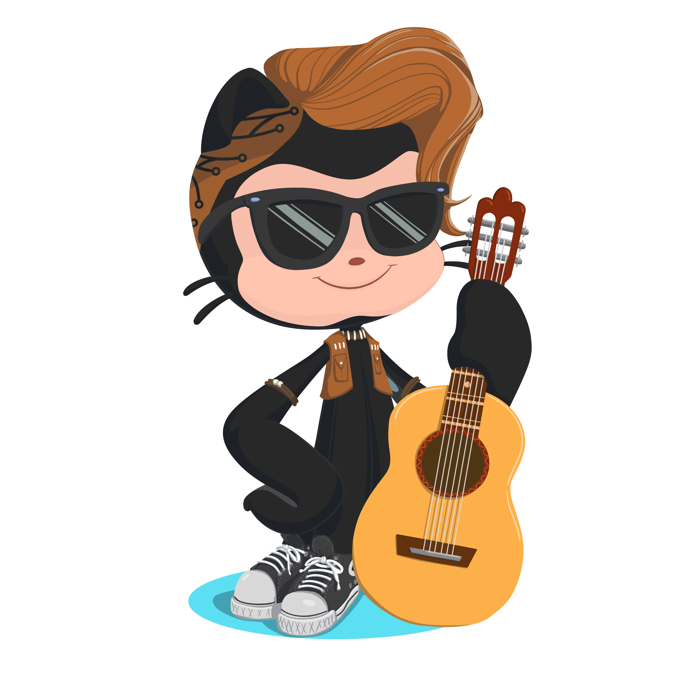

### Hi dear 👋
I am Ronis. I like classical rock and I'm also a graduate degree in phisics. Working directly with computacional physics. I walk sometimes in the late afternoon.
 
 <head>  <link  rel="stylesheet" href="./CSS/style.css"></head>
 

  

##

 
  

<a href="https://github.com/Ronis123">

  
  ##
    

 
  
  
  
  
  <!---->
  
  

  
  ##
 

 
  
  
 	<!--
 <!-- 
  -->
   

##

